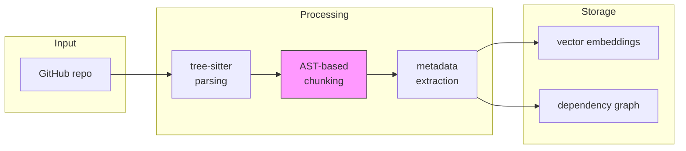
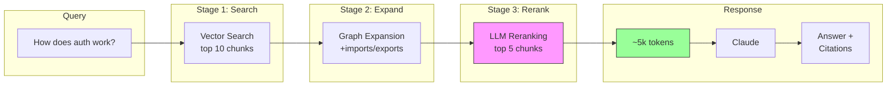

# nexu

[](https://opensource.org/licenses/MIT)
[](https://www.typescriptlang.org/)
[](https://nextjs.org/)

**Chat with your codebase.** AST-aware chunking + graph expansion for precise code retrieval.

[Live Demo](https://nexu.sh) | [Documentation](#docs)

## why nexu?

LLMs have token limits. Large codebases have millions of lines. The question isn't "how do we fit all the code?" - it's "how do we retrieve exactly what matters?"

nexu solves this with:
- **AST-based chunking** - Code is divided at function/class boundaries, never mid-statement
- **Dependency graph** - When you find a function, automatically include its imports
- **Two-stage retrieval** - Vector search finds candidates, LLM reranking picks the best
- **Lean context** - 5-10k tokens is the sweet spot; more tokens = more noise

## quick start

```bash
# clone and install
git clone https://github.com/nicholasgcoles/nexu
cd nexu && pnpm install

# configure
cp apps/api/.env.example apps/api/.env.local
# add your ANTHROPIC_API_KEY and OPENAI_API_KEY

# index a repository
pnpm ingest -- --repo https://github.com/owner/repo --prod

# start the app
pnpm dev
# web: http://localhost:5173
# api: http://localhost:3000
```

## how it works

### ingestion pipeline



### retrieval pipeline



## features

- **Multi-repo support** - Index and chat with multiple repositories
- **Streaming responses** - Real-time output with citations
- **GitHub integration** - Direct links to source code
- **Syntax highlighting** - Beautiful code display
- **Resumable indexing** - Continue from checkpoint after failures
- **Provider agnostic** - Works with Anthropic, OpenAI, or local LLMs

## stack

Vendor lock-in free by design.

| Component | Options |
|-----------|---------|
| **LLM** | Anthropic Claude, OpenAI GPT, Ollama (local) |
| **Embeddings** | OpenAI, Ollama (nomic-embed-text, etc.) |
| **Vector Store** | pgvector (Supabase or self-hosted) |
| **Frontend** | React + Vite + Tailwind + shadcn/ui |
| **Backend** | Next.js 14 (API routes) |
| **Parser** | tree-sitter (TypeScript, Python, Go, Rust, etc.) |

## configuration

```bash
# apps/api/.env.local

# LLM
LLM_PROVIDER=anthropic  # anthropic | openai | ollama
LLM_MODEL=claude-sonnet-4-20250514

# Embeddings
EMBEDDING_PROVIDER=openai
EMBEDDING_MODEL=text-embedding-3-small

# API Keys
ANTHROPIC_API_KEY=sk-ant-...
OPENAI_API_KEY=sk-...

# Database
DATABASE_URL=postgresql://...
VECTOR_STORE_TYPE=pgvector
```

## project structure

```
nexu/
├── apps/
│   ├── api/          # Next.js API (backend)
│   │   ├── src/
│   │   │   ├── app/api/     # API routes
│   │   │   └── lib/         # Core logic
│   │   └── scripts/         # Ingestion scripts
│   └── web/          # React frontend (Vite)
│       └── src/
│           ├── components/  # UI components
│           ├── hooks/       # React hooks
│           └── pages/       # Routes
└── packages/         # Shared packages (future)
```

## api endpoints

| Endpoint | Method | Description |
|----------|--------|-------------|
| `/api/chat` | POST | Streaming chat with citations |
| `/api/repositories` | GET | List indexed repositories |
| `/api/search` | POST | Search chunks (retrieval only) |

## backed by research

Our chunking approach is based on the **cAST paper** from Carnegie Mellon University (2025):

- [arxiv.org/abs/2506.15655](https://arxiv.org/abs/2506.15655)
- **+4.3 pts on Recall@5** vs fixed-size chunking
- Chunks align with functions, classes, types - never mid-statement

## comparison

| Approach | Context Used | Precision | Cost |
|----------|-------------|-----------|------|
| Naive (whole repo) | 200k+ tokens | Low | High |
| Fixed-size chunking | 20-50k tokens | Medium | Medium |
| **nexu (AST + graph)** | **5-10k tokens** | **High** | **Low** |

## roadmap

### v0.2 (next)
- [ ] Interactive dependency graph visualization
- [ ] Mermaid diagram generation for code architecture
- [ ] Call graph visualization
- [ ] File tree explorer with search

### v0.3
- [ ] Multi-turn conversation memory
- [ ] Code editing suggestions with diffs
- [ ] VSCode extension
- [ ] CLI tool (`npx nexu chat`)

### v0.4
- [ ] GitHub App for automatic indexing
- [ ] Team workspaces
- [ ] Custom system prompts per repo
- [ ] Webhook notifications

### future ideas
- Electron desktop app
- Self-hosted Docker image
- Plugin system for custom parsers
- Code review integration

## contributing

Contributions are welcome! Please read our contributing guidelines (coming soon).

```bash
# development
pnpm install
pnpm dev

# run tests
pnpm test

# lint
pnpm lint
```

## license

MIT - see [LICENSE](LICENSE) for details.

## acknowledgments

- [cAST paper](https://arxiv.org/abs/2506.15655) - AST-based chunking research
- [tree-sitter](https://tree-sitter.github.io/tree-sitter/) - Incremental parsing
- [shadcn/ui](https://ui.shadcn.com/) - UI components
- [Vercel AI SDK](https://sdk.vercel.ai/) - Streaming utilities
