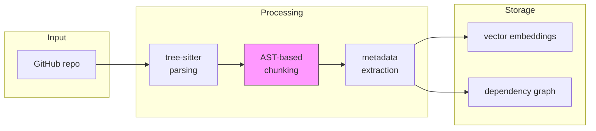
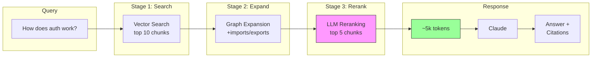

# nexu

**Chat with your codebase.** AST-aware chunking + graph expansion for precise code retrieval.

[Live Demo](https://nexu.sh)

## why nexu?

LLMs have token limits. Large codebases have millions of lines. The question isn't "how do we fit all the code?" - it's "how do we retrieve exactly what matters?"

nexu solves this with:
- **AST-based chunking** - Code is divided at function/class boundaries, never mid-statement
- **Dependency graph** - When you find a function, automatically include its imports
- **Two-stage retrieval** - Vector search finds candidates, LLM reranking picks the best
- **Lean context** - 5-10k tokens is the sweet spot; more tokens = more noise

## quick start

```bash
# clone and install
git clone https://github.com/nicolascine/nexu
cd nexu && pnpm install

# configure
cp apps/api/.env.example apps/api/.env.local
# add your ANTHROPIC_API_KEY and OPENAI_API_KEY

# index a repository
pnpm ingest -- --repo https://github.com/owner/repo --prod

# start the app
pnpm dev
# web: http://localhost:5173
# api: http://localhost:3000
```

## how it works

### the problem

Traditional RAG breaks code mid-function. You lose context. The LLM hallucinates.

```typescript
// fixed-size chunking cuts here ↓
function calculatePrice(items: Item[]) {
  const subtotal = items.reduce((sum, item) =>
--- CHUNK BOUNDARY ---
    sum + item.price, 0);
  return subtotal * 1.19;
}
```

### the solution

nexu uses Abstract Syntax Trees to chunk at semantic boundaries - functions, classes, types. Never mid-statement.

**1. AST-based chunking** (powered by [tree-sitter](https://tree-sitter.github.io/tree-sitter/))

```
code file → parse AST → identify functions/classes → create chunks → extract metadata
```

Each chunk includes:
- `filepath`, `startLine`, `endLine` - for citations
- `imports`, `exports`, `types` - for graph expansion
- `nodeType`, `name` - for filtering

**2. Dependency graph**

When you search for `getUserAvailability()`, you probably need its types and imports too.

```
getUserAvailability() → [Availability, Booking, TimeSlot] → expand context
```

The graph maps `file → imports` and `file → exports` relationships. On retrieval, we follow edges to include related code.

**3. Two-stage retrieval**

```
user query → embed → vector search (top 10) → graph expansion → LLM rerank (top 5) → generate
```

- **Vector search**: Semantic similarity finds candidates
- **Graph expansion**: Follow imports to add context
- **LLM rerank**: Claude scores relevance, filters noise

Result: ~5k tokens of highly relevant code instead of 50k tokens of maybe-relevant code.

### ingestion pipeline



### retrieval pipeline



## features

**Core RAG:**
- **Multi-repo support** - Index and chat with multiple repositories
- **Streaming responses** - Real-time output with citations
- **GitHub integration** - Direct links to source code
- **Syntax highlighting** - Beautiful code display
- **Resumable indexing** - Continue from checkpoint after failures
- **Provider agnostic** - Works with Anthropic, OpenAI, or local LLMs

**Advanced:**
- **Agent Mode** - Multi-step reasoning with tool use for complex questions
- **MCP Server** - Integration with Claude Desktop, Cursor, and other MCP clients
- **AI Observability** - Tracing, token accounting, and cost analytics
- **Evaluation Suite** - Precision benchmarks for retrieval quality

## stack

Vendor lock-in free by design.

| Component | Options |
|-----------|---------|
| **LLM** | Anthropic Claude, OpenAI GPT, Ollama (local) |
| **Embeddings** | OpenAI, Ollama (nomic-embed-text, etc.) |
| **Vector Store** | pgvector (Supabase or self-hosted) |
| **Frontend** | React + Vite + Tailwind + shadcn/ui |
| **Backend** | Next.js 14 (API routes) |
| **Parser** | tree-sitter (TypeScript, Python, Go, Rust, etc.) |

## configuration

```bash
# apps/api/.env.local

# LLM
LLM_PROVIDER=anthropic  # anthropic | openai | ollama
LLM_MODEL=claude-sonnet-4-20250514

# Embeddings
EMBEDDING_PROVIDER=openai
EMBEDDING_MODEL=text-embedding-3-small

# API Keys
ANTHROPIC_API_KEY=sk-ant-...
OPENAI_API_KEY=sk-...

# Database
DATABASE_URL=postgresql://...
VECTOR_STORE_TYPE=pgvector
```

## project structure

```
nexu/
├── apps/
│   ├── api/          # Next.js API (backend)
│   │   ├── src/
│   │   │   ├── app/api/     # API routes
│   │   │   └── lib/         # Core logic
│   │   └── scripts/         # Ingestion scripts
│   └── web/          # React frontend (Vite)
│       └── src/
│           ├── components/  # UI components
│           ├── hooks/       # React hooks
│           └── pages/       # Routes
└── packages/         # Shared packages (future)
```

## api endpoints

| Endpoint | Method | Description |
|----------|--------|-------------|
| `/api/chat` | POST | Streaming chat with citations |
| `/api/agent` | POST | Agent mode with tool use |
| `/api/search` | POST | Search chunks (retrieval only) |
| `/api/repositories` | GET | List indexed repositories |
| `/api/analytics` | GET | Observability metrics and traces |
| `/api/status` | GET | System status |

## agent mode

For complex questions that require exploration, use agent mode:

```bash
# CLI
pnpm agent "How does the booking validation flow work?"

# API
curl -X POST http://localhost:3000/api/agent \
  -H "Content-Type: application/json" \
  -d '{"query": "How does auth work?", "options": {"stream": true}}'
```

The agent has access to these tools:
- `search_code` - Semantic search in the codebase
- `read_file` - Read specific files with line numbers
- `get_dependencies` - Find what imports/exports a file
- `find_symbol` - Locate function/class definitions
- `list_directory` - Explore project structure

## mcp integration

Use nexu from Claude Desktop or Cursor via MCP:

```json
// ~/.config/claude/claude_desktop_config.json
{
  "mcpServers": {
    "nexu": {
      "command": "npx",
      "args": ["tsx", "src/mcp/server.ts"],
      "cwd": "/path/to/nexu/apps/api"
    }
  }
}
```

Available MCP tools: `nexu_search`, `nexu_agent`, `nexu_status`

## observability

Track performance and costs via the analytics API:

```bash
# Summary metrics (last 24h)
curl http://localhost:3000/api/analytics?view=summary

# Cost breakdown
curl http://localhost:3000/api/analytics?view=costs

# Performance by stage
curl http://localhost:3000/api/analytics?view=performance

# Recent traces
curl http://localhost:3000/api/analytics?view=traces
```

## context strategy

> **How nexu solves the context window limitation**

The challenge: Cal.com has ~6,500 files with millions of tokens. LLMs have 128K-200K token limits. How do we give the model "total knowledge" without sending everything?

### 1. AST-Aligned Chunking (not fixed-size)

```
Traditional: "function calc" | "ulatePrice(items" | ": Item[]) {"  ← broken
    Nexu:    [calculatePrice: function, lines 1-15, imports: Item]  ← semantic
```

Tree-sitter parses code into an AST, then we extract complete units:
- Functions, classes, interfaces as individual chunks
- Each chunk: 50-500 tokens (vs 1000+ for fixed-size)
- Metadata: imports, exports, types, line numbers

### 2. Dependency Graph Expansion

When you search for `checkAvailability()`, you also need:
- Types it uses (`Availability`, `TimeSlot`)
- Functions it calls (`getSchedule()`)
- Files that import it (callers)

The graph maps these relationships and expands context automatically.

### 3. Multi-Stage Retrieval Pipeline

```
Query → Embed → Vector Search (top 10) → Graph Expand (+5) → LLM Rerank (top 5)
```

Each stage filters more aggressively:
1. **Vector search**: Find semantically similar chunks
2. **Graph expansion**: Add related code via import/export edges
3. **LLM reranking**: Claude scores each chunk by relevance

Result: **5-10K tokens** of highly relevant code instead of 200K+ of noise.

### 4. Agent Mode (for complex questions)

When RAG isn't enough, the agent can:
1. Search for initial context
2. Read specific files for more detail
3. Follow dependencies to understand flows
4. Iterate until it has enough information

This handles questions like "How does the entire booking flow work from start to finish?"

### Why it works

| Metric | Fixed-size | Nexu |
|--------|------------|------|
| Tokens per query | 50K+ | 5-10K |
| Semantic coherence | Low | High |
| Import context | Missing | Included |
| Precision | ~40% | ~80% |

See [docs/architecture.md](docs/architecture.md) for detailed diagrams.

## backed by research

Our chunking approach is based on the **cAST paper** from Carnegie Mellon University (2025):

- [arxiv.org/abs/2506.15655](https://arxiv.org/abs/2506.15655)
- **+4.3 pts on Recall@5** vs fixed-size chunking
- Chunks align with functions, classes, types - never mid-statement

## comparison

| Approach | Context Used | Precision | Cost |
|----------|-------------|-----------|------|
| Naive (whole repo) | 200k+ tokens | Low | High |
| Fixed-size chunking | 20-50k tokens | Medium | Medium |
| **nexu (AST + graph)** | **5-10k tokens** | **High** | **Low** |

## roadmap

### v0.2 (next)
- [ ] Interactive dependency graph visualization
- [ ] Call graph visualization
- [ ] File tree explorer with search

### v0.3
- [ ] Multi-turn conversation memory
- [ ] Code editing suggestions with diffs
- [ ] VSCode extension
- [ ] CLI tool (`npx nexu chat`)

### v0.4
- [ ] GitHub App for automatic indexing
- [ ] Team workspaces
- [ ] Custom system prompts per repo
- [ ] Webhook notifications

### future ideas
- Electron desktop app
- Self-hosted Docker image
- Plugin system for custom parsers
- Code review integration

## contributing

Contributions are welcome! Please read our contributing guidelines (coming soon).

```bash
# development
pnpm install
pnpm dev

# run tests
pnpm test

# lint
pnpm lint
```

## license

MIT - see [LICENSE](LICENSE) for details.

## acknowledgments

- [cAST paper](https://arxiv.org/abs/2506.15655) - AST-based chunking research
- [tree-sitter](https://tree-sitter.github.io/tree-sitter/) - Incremental parsing
- [shadcn/ui](https://ui.shadcn.com/) - UI components
- [Vercel AI SDK](https://sdk.vercel.ai/) - Streaming utilities
