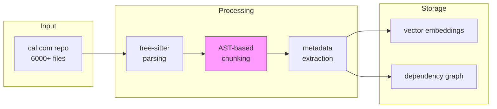
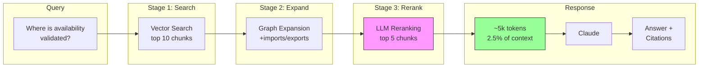

# nexu

RAG for codebases. AST-aware chunking + graph expansion.

> Technical challenge: Build a chat interface to query large codebases (cal.com monorepo, ~500k LOC) without exceeding LLM context limits.

## the problem

LLMs have token limits. Cal.com has ~500k LOC across 6000+ TypeScript files. The question isn't "how do we fit all the code?" - it's "how do we retrieve exactly what matters?"

## how nexu solves the context limit

### ingestion pipeline (offline)



> **Key insight:** Chunks respect syntactic boundaries (functions, classes). Never break code mid-statement. Each chunk is a complete semantic unit.

### retrieval pipeline (online)



> **Key insight:** Graph expansion follows imports/exports to add related code. LLM reranking filters noise. Result: precise, minimal context.

### why this works

1. **AST chunking** - Code is divided at function/class boundaries, never mid-statement
2. **Dependency graph** - When you find `isAvailableHandler`, automatically include its imports
3. **Two-stage retrieval** - Vector search finds candidates, LLM reranking picks the best
4. **Lean context** - 5-10k tokens is the sweet spot; more tokens = more noise

## quick start

```bash
# 1. clone and install
git clone https://github.com/nicolascine/nexu
cd nexu && pnpm install

# 2. configure (see .env.example)
cp .env.example .env.local
# add your ANTHROPIC_API_KEY and OPENAI_API_KEY

# 3. index cal.com
git clone --depth 1 https://github.com/calcom/cal.com /tmp/cal.com
npm run ingest -- --path /tmp/cal.com

# 4. query
npm run chat
# or single query:
npm run query -- "Where is availability validated?"
```

## approach

nexu doesn't try to shove the whole codebase into context. instead:

1. **structural chunking** - AST-based, preserves syntactic integrity
2. **rich metadata** - imports, types, exports per chunk
3. **dependency graph** - expands context following real relationships
4. **two-stage retrieval** - semantic search + LLM reranking
5. **precise citations** - path + lines, always

## why it works

### the "lost in the middle" problem

research shows LLMs degrade on massive contexts - they attend to start and end, middle gets lost. more tokens ≠ better understanding.

### our take

instead of fighting the limit, work with it:
- ~5k tokens of ultra-relevant context
- AST chunking preserves structure
- graph expansion adds only what's needed
- LLM sees complete, coherent code

## backed by research

### cAST: structural chunking via AST

our core approach is based on the **cAST paper** from Carnegie Mellon University (2025).

**paper:** [arxiv.org/abs/2506.15655](https://arxiv.org/abs/2506.15655)
**reference implementation:** [github.com/yilinjz/astchunk](https://github.com/yilinjz/astchunk)

**why cAST matters:**

traditional RAG systems chunk code by token count or line count. this breaks code mid-function, mid-class, destroying semantic meaning. cAST uses Abstract Syntax Trees to create chunks that respect code structure:

- **+4.3 pts on Recall@5** vs fixed-size chunking
- chunks align with functions, classes, types - never mid-statement
- metadata (imports, exports, types) preserved per chunk
- enables dependency graph construction for context expansion

```
fixed-size chunking:        cAST chunking:
┌──────────────┐            ┌──────────────┐
│ function foo │            │ function foo │
│   const x =  │  broken!   │   const x =  │  complete
├──────────────┤            │   return x   │  semantic
│   return x   │            │ }            │  unit
│ }            │            └──────────────┘
│ function bar │            ┌──────────────┐
└──────────────┤            │ function bar │
```

### other research

- **Qodo.ai** (2024) - two-stage retrieval in production across 10k repos
- **"Lost in the Middle"** (Liu et al. 2023) - why bigger context ≠ better

## stack

vendor lock-in free by design.

**core**
- next.js 14 (app router) + tailwind + shadcn/ui
- tree-sitter for AST parsing

**vector storage**
- pgvector (supabase or self-hosted postgres)

**LLM providers** (swappable via abstraction layer)
- anthropic (claude)
- openai
- local LLMs via OpenAI-compatible API:
  - [ollama](https://ollama.ai) - simplest local setup
  - [vllm](https://github.com/vllm-project/vllm) - production-grade inference
  - [lm studio](https://lmstudio.ai) - GUI + local server
  - deepseek, qwen, llama, etc.

**embeddings** (also swappable)
- openai text-embedding-3-small
- local: nomic-embed-text, bge, etc. via ollama

## architecture

See [how nexu solves the context limit](#how-nexu-solves-the-context-limit) for visual diagrams.

For implementation details, see `docs/architecture.md`.

## comparison

| approach | context used | precision | cost |
|----------|-------------|-----------|------|
| naive (whole repo) | 200k+ tokens | low | high |
| fixed-size chunking | 20-50k tokens | medium | medium |
| **nexu (AST + graph)** | **5-10k tokens** | **high** | **low** |
| agentic (with tools) | variable (50-150k) | medium | very high |

## experiment: cal.com monorepo

We tested nexu on the [cal.com](https://github.com/calcom/cal.com) monorepo - the target codebase for this technical challenge.

### indexing results

| metric | value |
|--------|-------|
| TypeScript files | 6,451 |
| Chunks extracted | 25,868 |
| Graph edges | 11,812 |
| Avg imports/file | 1.8 |
| Index size | 287 MB |
| Indexing time | ~45 min (local Ollama) |

### query test

**Query:** "Where is availability validated?"

**System response:**
> Availability validation occurs primarily within the function `getUserAvailability` located in:
> `packages/features/availability/lib/getUserAvailability.ts`

**Verification:** The file exists (24KB) and contains:
- Zod schema validation (`availabilitySchema`)
- Imports from `getBusyTimesFromLimits`, `getWorkingHours`
- Date range validation with `DateOverride`, `WorkingHours`
- Integration with `BookingRepository`

### performance

| metric | value |
|--------|-------|
| Chunks retrieved | 5 |
| Retrieval stage | reranked |
| Tokens used | 2,943 |
| Response time | ~30s (local LLM) |
| Context usage | 1.5% of 200k window |

The system correctly identified the core availability validation logic without hallucinating file paths or inventing code.

## limitations

- **broad queries** - "explain the whole architecture" needs multiple queries
- **highly coupled code** - graph expansion can explode
- **obscure languages** - tree-sitter might not have a parser
- **legacy spaghetti** - AST chunking assumes somewhat structured code

## configuration

```bash
# .env.local

# LLM provider: "anthropic" | "openai" | "ollama" | "custom"
LLM_PROVIDER=anthropic
LLM_MODEL=claude-sonnet-4-20250514

# for local LLMs (ollama, vllm, lm studio)
# LLM_PROVIDER=ollama
# LLM_BASE_URL=http://localhost:11434/v1
# LLM_MODEL=deepseek-coder-v2

# embeddings: "openai" | "ollama"
EMBEDDING_PROVIDER=openai
EMBEDDING_MODEL=text-embedding-3-small

# for local embeddings
# EMBEDDING_PROVIDER=ollama
# EMBEDDING_BASE_URL=http://localhost:11434/v1
# EMBEDDING_MODEL=nomic-embed-text

# API keys (only needed for cloud providers)
ANTHROPIC_API_KEY=sk-ant-...
OPENAI_API_KEY=sk-...

# vector db
DATABASE_URL=postgresql://...
```

## dev

```bash
pnpm install
pnpm run ingest  # index cal.com (one-time)
pnpm dev
```

### running with local LLMs

```bash
# install ollama
curl -fsSL https://ollama.ai/install.sh | sh

# pull a model
ollama pull deepseek-coder-v2
ollama pull nomic-embed-text

# update .env.local to use ollama
# then run normally
pnpm dev
```

## docs

- `docs/architecture.md` - system design
- `docs/science.md` - research backing
- `docs/ui.md` - interface design

## license

MIT
