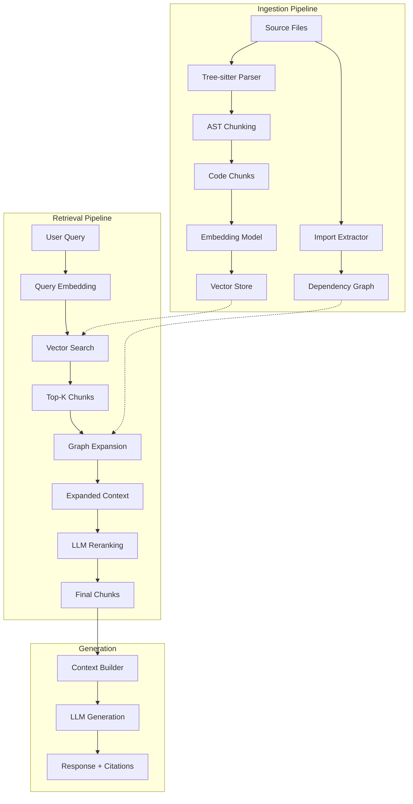
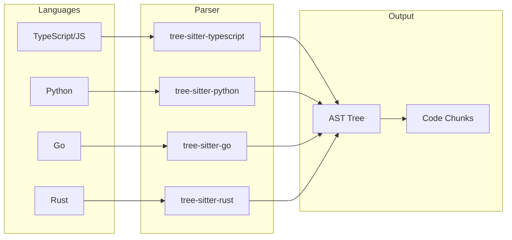
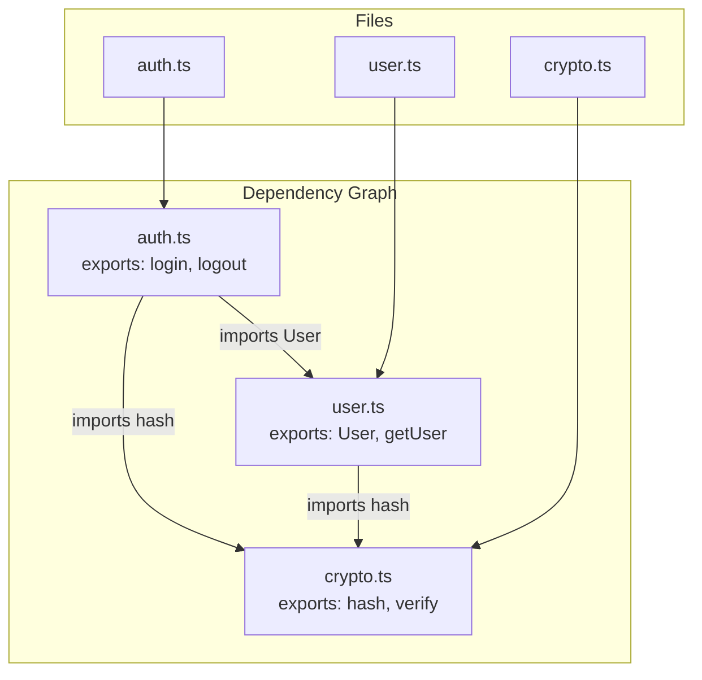
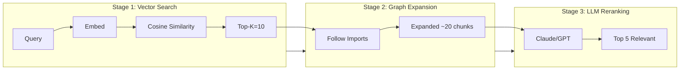
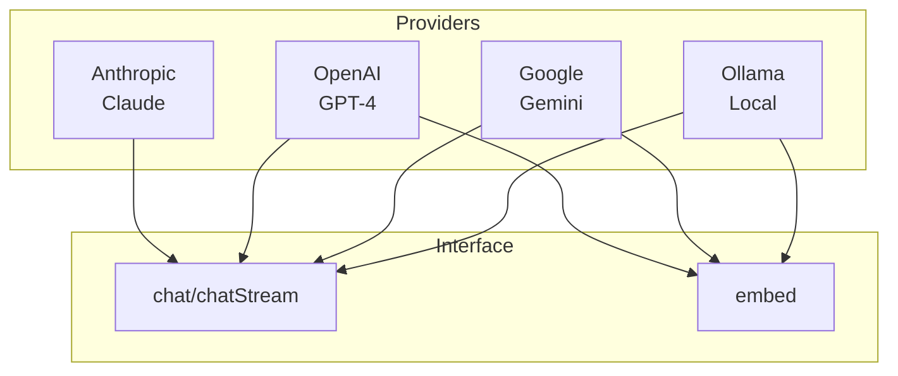
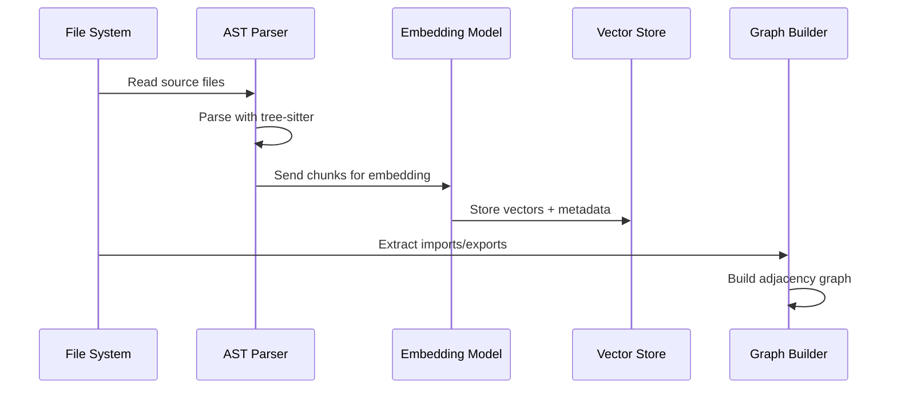
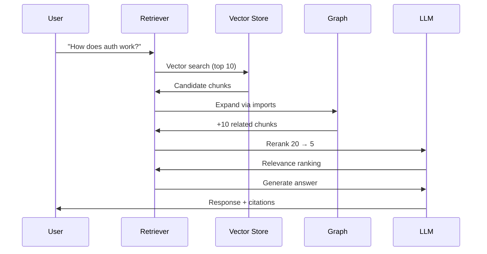

# Nexu Architecture Overview

Code RAG system implementing the cAST approach (AST-based chunking + graph expansion + LLM reranking).

## System Architecture



## Component Details

### 1. AST Parser (`src/lib/ast/index.ts`)

Multi-language code parsing using tree-sitter.



**Chunk types extracted:**
- Functions/methods
- Classes
- Interfaces/types
- Structs (Go/Rust)
- Modules

**Chunk metadata:**
```typescript
interface CodeChunk {
  id: string;           // hash-based unique ID
  content: string;      // source code
  filepath: string;
  startLine: number;
  endLine: number;
  nodeType: 'function' | 'class' | 'interface' | 'type' | 'struct' | 'module' | 'other';
  name: string;
  language: Language;
  imports: string[];
  exports: string[];
  types: string[];
}
```

### 2. Dependency Graph (`src/lib/graph/index.ts`)

Tracks import/export relationships for context expansion.



**Graph operations:**
- `getDependencies(file)` - files this file imports
- `getDependents(file)` - files that import this file
- `expandContext(files, maxHops)` - BFS expansion

### 3. Retrieval Pipeline (`src/lib/retrieval/index.ts`)

Three-stage retrieval following cAST/Qodo.ai approach:



**Current parameters:**
| Parameter | Value | Description |
|-----------|-------|-------------|
| topK | 10 | Initial vector search results |
| minScore | 0.3 | Minimum similarity threshold |
| maxHops | 2 | Graph expansion depth |
| maxExpandedChunks | 20 | Max chunks after expansion |
| rerankTopK | 5 | Final chunks after reranking |

### 4. LLM Integration (`src/lib/llm/`)

Provider-agnostic LLM layer.



**Environment variables:**
```bash
# LLM (for generation/reranking)
LLM_PROVIDER=anthropic|openai|gemini|ollama
ANTHROPIC_API_KEY=...
OPENAI_API_KEY=...

# Embeddings
EMBEDDING_PROVIDER=openai|gemini|ollama
EMBEDDING_MODEL=text-embedding-3-small
```

## Data Flow

### Ingestion Flow



### Query Flow



## File Structure

```
src/
├── lib/
│   ├── ast/
│   │   └── index.ts          # Tree-sitter parsing, chunking
│   ├── graph/
│   │   └── index.ts          # Dependency graph construction
│   ├── retrieval/
│   │   ├── index.ts          # Retrieval pipeline orchestration
│   │   └── vector-store.ts   # In-memory vector store
│   └── llm/
│       ├── index.ts          # LLM abstraction layer
│       ├── config.ts         # Provider configuration
│       ├── types.ts          # Type definitions
│       └── providers/
│           ├── anthropic.ts  # Claude integration
│           ├── gemini.ts     # Gemini integration
│           └── openai-compatible.ts  # OpenAI/Ollama
├── app/                      # Next.js app router (UI)
scripts/
├── ingest.ts                 # Index a codebase
├── query.ts                  # Single query
└── chat.ts                   # Interactive chat
tests/
├── unit/                     # Unit tests
├── eval/                     # Evaluation harness
└── fixtures/                 # Test data
```

## Evaluation Metrics

Current performance on nexu codebase (11 files, 98 chunks):

| Metric | Score | Target |
|--------|-------|--------|
| MRR | 83.3% | >80% |
| Recall | 75.0% | >80% |
| Precision | 54.2% | >70% |

**Note:** Current eval does NOT use LLM reranking. Enabling it should improve precision.

## Key Design Decisions

1. **AST-based chunking** over fixed-size: Preserves semantic boundaries (cAST paper: +4.3 pts recall)

2. **Graph expansion** over vector-only: Follows imports for related context (80% of deps are 1-2 hops)

3. **Lean context** (5-10k tokens) over massive context: Avoids "lost in the middle" problem

4. **LLM reranking** as final stage: Filters noise from vector search (Qodo.ai: "crucial at scale")

5. **Provider abstraction**: No vendor lock-in, easy to switch LLMs

## References

- [cAST Paper](https://arxiv.org/abs/2506.15655) - AST-based chunking approach
- [Qodo.ai Blog](https://www.qodo.ai/blog/rag-for-large-scale-code-repos/) - Production RAG at scale
- [Lost in the Middle](https://arxiv.org/abs/2307.03172) - Why lean context matters
