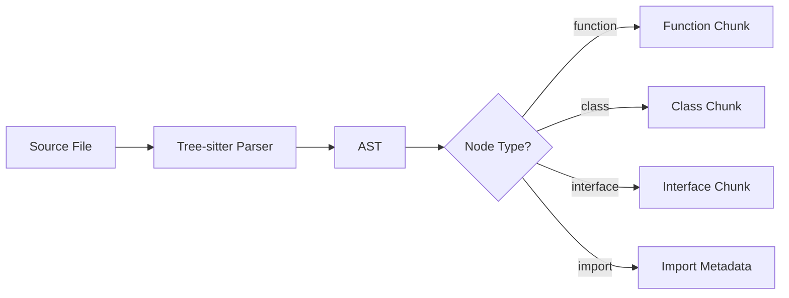
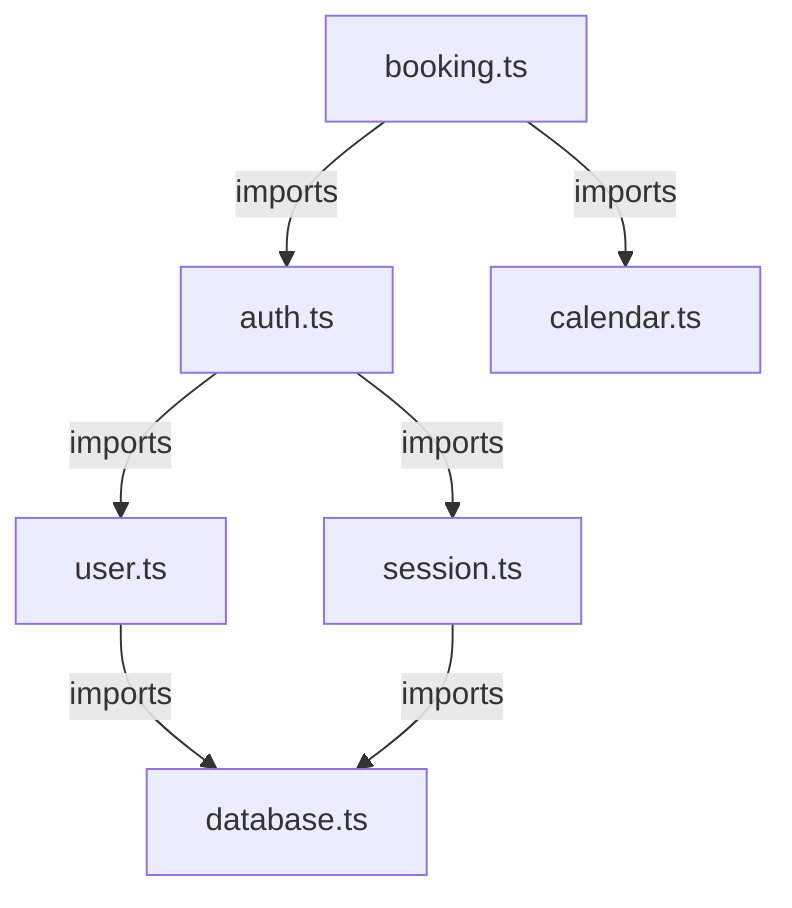
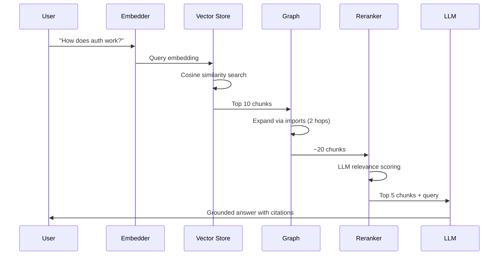
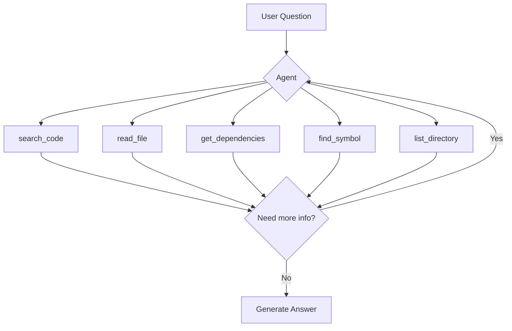
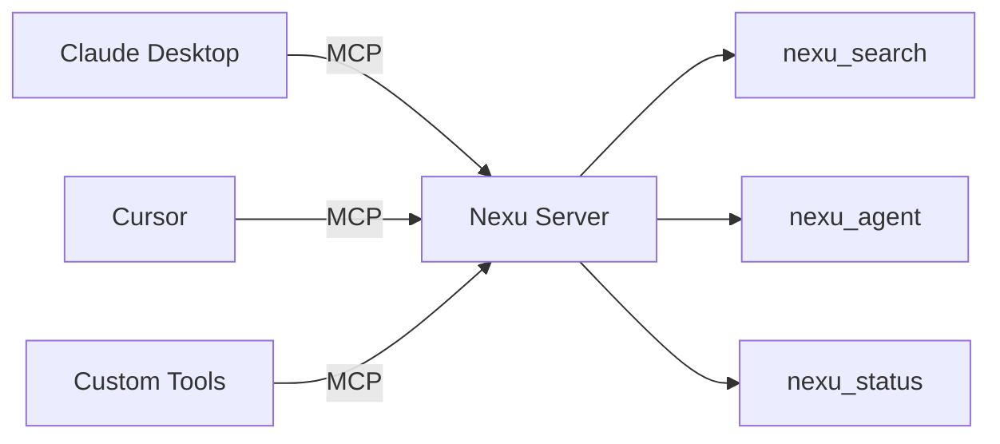
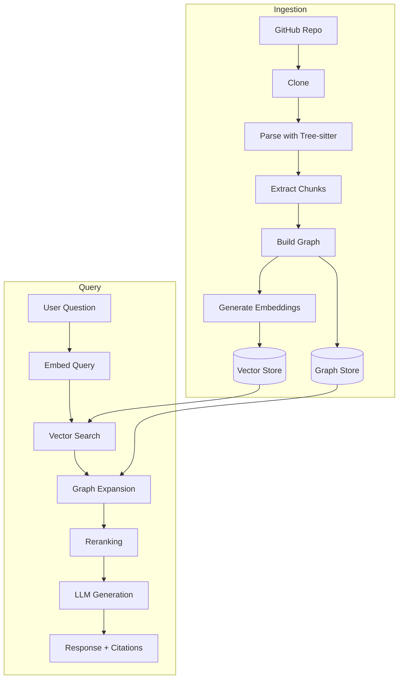

# Nexu Architecture

## Overview

Nexu is a RAG (Retrieval-Augmented Generation) system specifically designed for codebases. It solves the **context window limitation** problem when querying large repositories like Cal.com (~6,500 files).

## The Problem

LLMs have token limits (128k-200k tokens). A large codebase like Cal.com has millions of tokens. Naive approaches fail:

| Approach | Problem |
|----------|---------|
| Send everything | Exceeds token limits, prohibitive cost |
| Random sampling | Misses relevant code |
| Fixed-size chunking | Breaks code semantics |
| Simple keyword search | Poor semantic understanding |

## The Solution: AST-Aligned RAG with Graph Expansion

Nexu uses a three-stage retrieval pipeline that respects code structure:

```
Query → Embed → Vector Search → Graph Expansion → Rerank → LLM Generate
         ↓           ↓               ↓              ↓
      OpenAI    Semantic       Follow imports    Claude/LLM
     Embedding  similarity     & exports        relevance
```

### Stage 1: AST-Aligned Chunking

Instead of splitting code by character count, we use **Tree-sitter** to parse code and chunk at semantic boundaries:



**Benefits:**
- Each chunk is a complete semantic unit (function, class, interface)
- Imports/exports are extracted as metadata
- Chunk boundaries respect code structure
- Typical chunk: 50-500 tokens (vs 1000+ for fixed-size)

### Stage 2: Dependency Graph

We build a graph of file relationships from import/export statements:



**Graph Structure:**
- **Nodes**: Files with their exports and chunks
- **Edges**: Import relationships (A imports B = edge A→B)
- **Reverse edges**: What files import this one

### Stage 3: Retrieval Pipeline



**Pipeline Details:**

1. **Vector Search** (Stage 1)
   - Query embedded with OpenAI `text-embedding-3-small`
   - Cosine similarity against all chunk embeddings
   - Returns top-K most semantically similar chunks

2. **Graph Expansion** (Stage 2)
   - For each retrieved chunk, follow import/export edges
   - BFS traversal up to 2 hops
   - Adds context from related files
   - Deduplicates and limits to max chunks

3. **Reranking** (Stage 3)
   - Options: BGE (fast), LLM (accurate), none
   - LLM reranker asks Claude to rank by relevance
   - Returns top-K most relevant chunks

4. **Generation** (Stage 4)
   - Context: ~5-10K tokens of relevant code
   - System prompt enforces citations
   - Streaming response with file references

## Agent Mode (Advanced)

For complex questions, Nexu supports **agentic reasoning** with tool use:



**Tools Available:**
- `search_code`: Semantic search in codebase
- `read_file`: Read specific file with line numbers
- `get_dependencies`: Find imports/importers of a file
- `find_symbol`: Locate function/class definitions
- `list_directory`: Explore project structure

The agent can iteratively search, read files, and follow dependencies until it has enough context to answer accurately.

## MCP Integration

Nexu exposes capabilities via the **Model Context Protocol** for integration with Claude Desktop, Cursor, and other tools:



## Observability

Every request is traced for performance and cost analysis:

```mermaid
graph TD
    A[Request] --> B[Start Trace]
    B --> C[Span: init_index]
    C --> D[Span: retrieval]
    D --> E[Span: generation]
    E --> F[End Trace]
    F --> G[Analytics API]

    G --> H[/api/analytics?view=summary]
    G --> I[/api/analytics?view=costs]
    G --> J[/api/analytics?view=performance]
```

**Tracked Metrics:**
- Latency per stage (embedding, search, rerank, generate)
- Token usage (input/output)
- Cost estimates (per model pricing)
- Success/failure rates
- Chunks retrieved

## Data Flow



## Technology Stack

| Component | Technology | Purpose |
|-----------|-----------|---------|
| AST Parsing | Tree-sitter | Language-aware code chunking |
| Embeddings | OpenAI/Gemini | Semantic vector representations |
| Vector Store | pgvector/JSON | Similarity search |
| LLM | Claude/GPT/Gemini | Generation and reranking |
| Framework | Next.js 14 | API routes and SSR |
| Frontend | React + Vite | Chat interface |
| Streaming | Vercel AI SDK | Real-time responses |

## Why This Approach Works

1. **Semantic Chunking**: Code chunks are meaningful units, not arbitrary splits
2. **Graph Context**: Related code is automatically included via dependency graph
3. **Multi-stage Filtering**: Vector search → graph expansion → LLM rerank progressively refines results
4. **Agentic Fallback**: Complex questions can use iterative reasoning
5. **Cost Efficient**: Only ~5-10K tokens per query vs 100K+ for naive approaches

## Comparison

| Approach | Tokens/Query | Precision | Cost |
|----------|-------------|-----------|------|
| Naive (all code) | 500K+ | N/A | $$$$ |
| Fixed-size chunks | 10-20K | Low | $$ |
| Keyword search | 5-10K | Medium | $ |
| **Nexu (AST+Graph)** | **5-10K** | **High** | **$** |

## References

- [cAST Paper](https://arxiv.org/abs/2506.15655) - Research foundation
- [Tree-sitter](https://tree-sitter.github.io/) - Incremental parsing
- [pgvector](https://github.com/pgvector/pgvector) - Vector similarity in PostgreSQL
